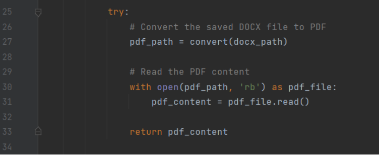
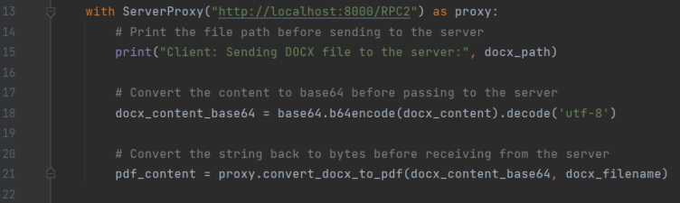

Descrição do Trabalho

O trabalho consiste na criação de um RPC server e client onde o utilizador poderá converter um ficheiro word para pdf, como extra o RPC server tem a habilidade de fazer a conversão do ficheiro a partir de um path absoluto ou relativo.

Implementação do Trabalho	
  Neste trabalho o objetivo é criar um servidor (RPC Server) onde este irá receber um ficheiro do Cliente (RPC Cliente) e irá converte-lo para pdf, para realizar esta função foram utilizadas as seguintes bibliotecas:

Xmlrpc.server - para criar o servidor RPC,
Xmlrpc.client (Proxy) - para criarmos pedidos ao servidor,
Os (Operating system) - Manipulação de diretórios,
Base64 - Converter o ficheiro word para bits,
Docx2pdf - Converter Word para Pdf.

Com estas bibliotecas é possível obter o nosso objetivo, o conteúdo do ficheiro word é convertido em bits e guardado numa variável que depois é enviado para o servidor, quando o mesmo se encontra no servidor (o mesmo está a “ouvir” no localhost:8000/RPC2) este irá converter os bits que recebeu para UTF-8 (bytes), e depois o cliente chama a função convert_docx_to_pdf que irá guardar os conteúdos do ficheiro word para um ficheiro temporário.

A seguir o servidor começa a conversão do conteúdo com o docx2pdf, o mesmo converte a informação do ficheiro word para pdf e envia para o cliente, o cliente irá então receber o conteúdo convertido e guarda-lo num ficheiro.

Para terminar o servidor limpa os ficheiros temporários que criou com os.remove(docx_path/pdf_path).

Por razões de segurança o servidor só responde a pedidos com o diretório /RPC2.

Funcionamento do trabalho	

Server:

Utilização das bibliotecas e método de segurança.

Criação do servidor com o endereço localhost e porta 8000.

Conversão do conteúdo do ficheiro docx para bytes, criação do path para podermos guardar o ficheiro pdf no mesmo local que o docx se encontrava, guardar o conteúdo do docx num ficheiro temporário.

Conversão dos conteúdos do ficheiro docx para pdf.

Remover os ficheiros temporários que foram criados na conversão, aplicar uma função de aviso de erro, e fazer com que o servidor corra para sempre.

Cliente:

Utilização das bibliotecas e envio do ficheiro docx.

Utilizando o proxy para enviar pedidos ao servidor a partir do endereço localhost:8000/RPC2, Conversão do conteúdo do ficheiro Docx antes de enviar para o servidor.

Guardar o conteúdo convertido pelo servidor para um ficheiro pdf na nossa máquina no mesmo diretório que se encontrava o ficheiro docx.
Conclusão

Em resumo, o projeto proporcionou valiosas perceções sobre a implementação de RPC para transmissão e conversão de ficheiros. A execução bem-sucedida da interação cliente-servidor usando XML-RPC estabelece as bases para melhorias e aperfeiçoamentos futuros para abordar preocupações de segurança, gestão de erros e escalabilidade.

Embora o projeto tenha alcançado os seus objetivos principais, foram encontrados alguns desafios. Por exemplo, a transmissão direta de ficheiros apresentou limitações devido à natureza dos protocolos RPC baseados em texto. Como solução alternativa, o conteúdo do ficheiro foi codificado (neste exemplo, Base64) e transmitido como texto.

Bibliografia
https://docs.python.org/3/library/xmlrpc.client.html

https://www.youtube.com/watch?v=clBj-s-3-IM (Exemplo Docx2pdf)

https://www.w3schools.com/python/module_os.asp (Comandos de OS)
